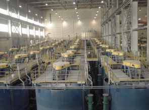
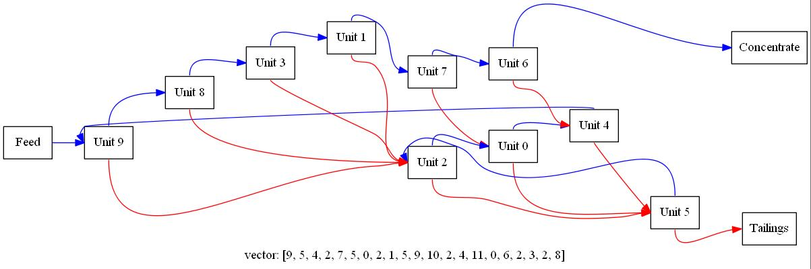

# Optimal Mineral Recovery with Genetic Algorithms

Mineral processing operations often use a series of separation units (known as circuits) to recover the target material into a concentrate stream and simultaneously filter out waste material to a tailings stream. Individual separation units have their own inefficiencies - hence such circuits are used to eliminate this problem. 

An economical optimisation problem arises out from the least amount of units required to separate the input material the quickest. 

  

Therefore, we (Team Gold) developed a C++ implementation of genetic algorithms parallelised with MPI and OpenMP to fast determine optimal circuit arrangements.

## Software implementation
Three versions of the software are implemented. 
* Non-parallel is in /GA-Mineral-Recovery.
* MPI parallelised is in /Parallel-Versions.
* OpenMP parallelised in in /Parallel-Versions.

## How to run
1. Make a new Visual Studio project, and link the /src folder and /Includes folder to the project.
2. Build and run project through IDE.
3. For MPI versions, one must move into the MPI folders and compile with:	mpic++ -std=c++11 *.h  *.cpp -o run

## Applications and Tools
* Animation and plotting graphs for the development of circuits
* Code tests
* extra_AdditionalComponents contains code that allows for additional flow components. Runs as n.

## Results
The full analytical report is described in the [ipython notebook](https://github.com/kev-fung/GA-Mineral-Recovery/blob/master/Analytical%20Report/Gold-Report.ipynb) with successful results.

  

